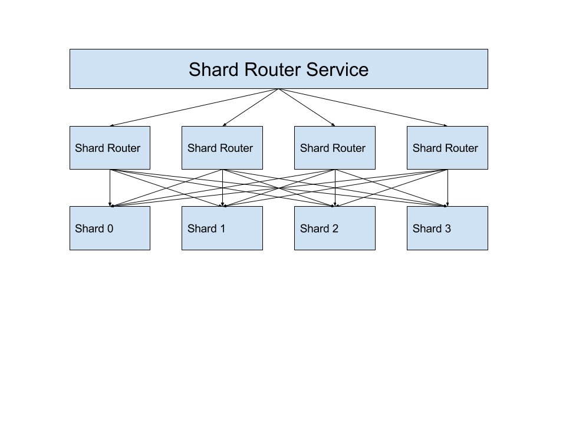

## Metaparticle/Sharding for .NET Core Tutorial

_Note, this is an advanced tutorial, please start with the [initial tutorial](tutorial.md)_

### Sharding
Sharding is the process of dividing requests between a server using some characteristic 
of the request to ensure all requests of the same type go to the same server. In contrast
to replicated serving, all requests that are the same, go to the same shard. Sharding is
useful because it ensures that only a small number of a containers handle any particular
request. This in turn ensures that caches stay hot and if failures occur, they are limited to a small subset of users.

Sharding is accomplished by appling a _ShardFunction_ to the request, the ShardFunction
returns a number, and this number is used to calculate the Shard (typically by taking the
result modulo the number of shards).

In this example, we are going to use the path of the request (e.g. `/some/url/path`) as 
the input to the shard function. Note that the ShardFunction is free to calculate the
shard number however it sees fit, as long as the number returned for the same input is
the same. In this tutorial, we will use a regular expression to select out a small part
of the path to be the shard key.

#### Shard Architecture
A typical shard architecture is a two layer design. The first layer or _shard router_ is
a stateless replicated service which is responsible for receiving user requests, calculating the shard number and sending requests on to the shards.

The second layer is the shards themselves. Because every shard is different, the sharding layer is not homogenous and can not be represented by a Kubernetes `Deployment` instead we use a `StatefulSet`.

A diagram of the shard architecture is below



### Deploying a sharded architecture
Typically a shard deployment would consist of two different application containers (the router and the shard), two different deployment configurations and two services to connect pieces together. That's a lot of YAML and a lot of complexity for an enduser to
absorb to implement a fairly straightforward concept.

To show how Metaparticle/Sharding can help dramatically simplify this, here is the corresponding code in Dotnet:

```cs
using System.IO;
using System.Net;
using Microsoft.AspNetCore;
using Microsoft.AspNetCore.Hosting;
using Microsoft.Extensions.Configuration;
using Microsoft.Extensions.Logging;
using static Metaparticle.Package.Driver;


namespace web
{
    public class Program
    {
        const int port = 8080;
		[Metaparticle.Runtime.Config(Ports = new int[] {port},
                                     Executor = "metaparticle",
                                     Shards = 3,
                                     ShardExpression = "^\\/users\\/([^\\/]*)\\/.*",
                                     Public = true)]
        [Metaparticle.Package.Config(Repository = "your-repo-name-here/dotnet-web",
                                     Publish = true,
                                     Verbose = true)]
        public static void Main(string[] args) => Containerize(args, () =>
       	{
            WebHost.CreateDefaultBuilder(args)
                .UseStartup<Startup>()
				.UseKestrel(options => { options.Listen(IPAddress.Any, port); })
                .Build()
                .Run();
    	});
    }
}
```

If you compare this sharded service with the replicated service we saw previously, you'll notice that two lines have been added to update the `[Metaparticle.Runtime.Config]` annotation to
indicate the number of shards and the regular expression to use to pick out the
sharding key:

```cs
     Shards = 3,
     ShardExpression = "^\\/users\\/([^\\/]*)\\/.*",
```

And that's it. When you compile and run this program, it deploys itself into Kubernetes as a sharded service.

If you're curious about the technical details about how this works, check out the
[metaparticle compiler project](https://github.com/metaparticle-io/metaparticle-ast)
